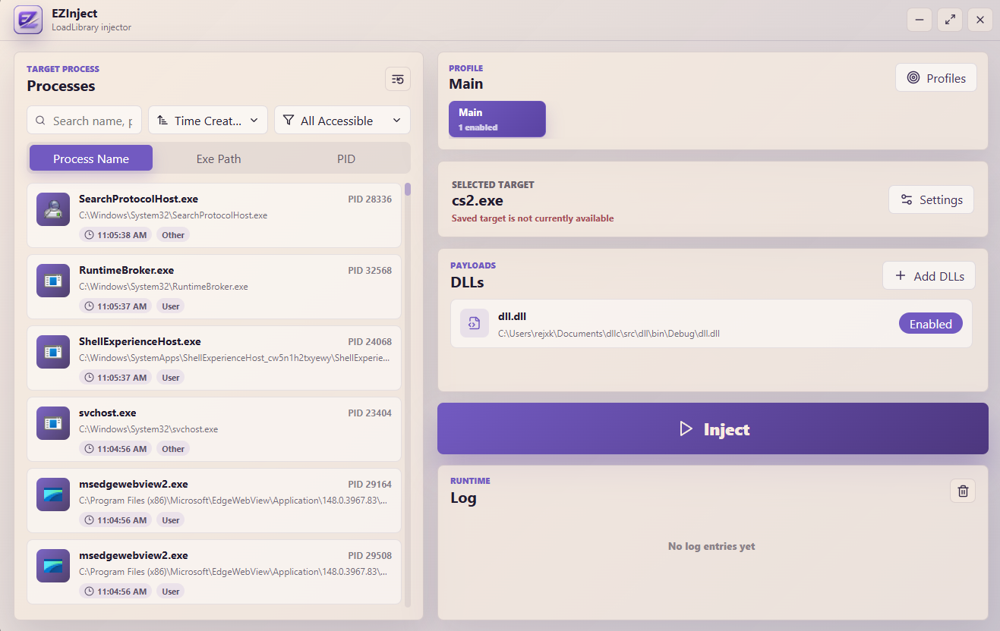

# EZInject

EZInject is a Windows desktop DLL injector with a polished Tauri interface and a conventional `LoadLibraryW` injection backend. It is built for simple, explicit injection workflows: pick a process, choose one or more DLLs, organize targets into profiles, and inject with clear progress and logging.

EZInject is intended for processes you own or are authorized to test. It does not include stealth injection, anti-cheat bypasses, protected-process bypasses, drivers, or evasion behavior.

## Preview



## Features

- Process browser with icons, PID, executable path, creation time, and window/user metadata where available.
- Search by process name, executable path, executable name, or PID.
- Sort processes by creation time or A-Z.
- Filter by all accessible processes, user processes, windowed processes, or the selected target match.
- Target by process name, executable path, or PID.
- Select multiple DLLs and temporarily disable DLLs from the right-click menu.
- Profiles for separate setups such as `Main` and `Debug`.
- Saves the active profile, selected target, target mode, DLL paths, and DLL enabled state.
- Configurable process refresh interval, success popup, confetti, and inject button animation.
- Runtime log for injection results and failures.
- Custom frameless, non-resizable window.
- Windows admin manifest enabled by default.

## Tech Stack

- Tauri v2
- React + Vite + TypeScript
- Rust backend
- Windows WinAPI process enumeration and `LoadLibraryW` injection

## Development

Install dependencies:

```powershell
npm ci
```

Run the app in development mode:

```powershell
npm run tauri:dev
```

Because EZInject requests administrator privileges, run the terminal as Administrator for development launches. Without elevation, Windows may return `os error 740`.

## Build

Create a release build:

```powershell
npm run tauri:build
```

Build outputs:

```text
src-tauri\target\release\*.exe
src-tauri\target\release\bundle\nsis\*-setup.exe
src-tauri\target\release\bundle\msi\*.msi
```

For a debug bundle:

```powershell
npm exec tauri build -- --debug
```

## GitHub Releases

The repository includes a GitHub Actions workflow that runs on every push to `master`.

It builds EZInject on `windows-latest` and publishes a release tagged with the commit short SHA:

```text
master-<short-sha>
```

Release assets:

```text
EZInject.exe
EZInject-setup.exe
EZInject.msi
```